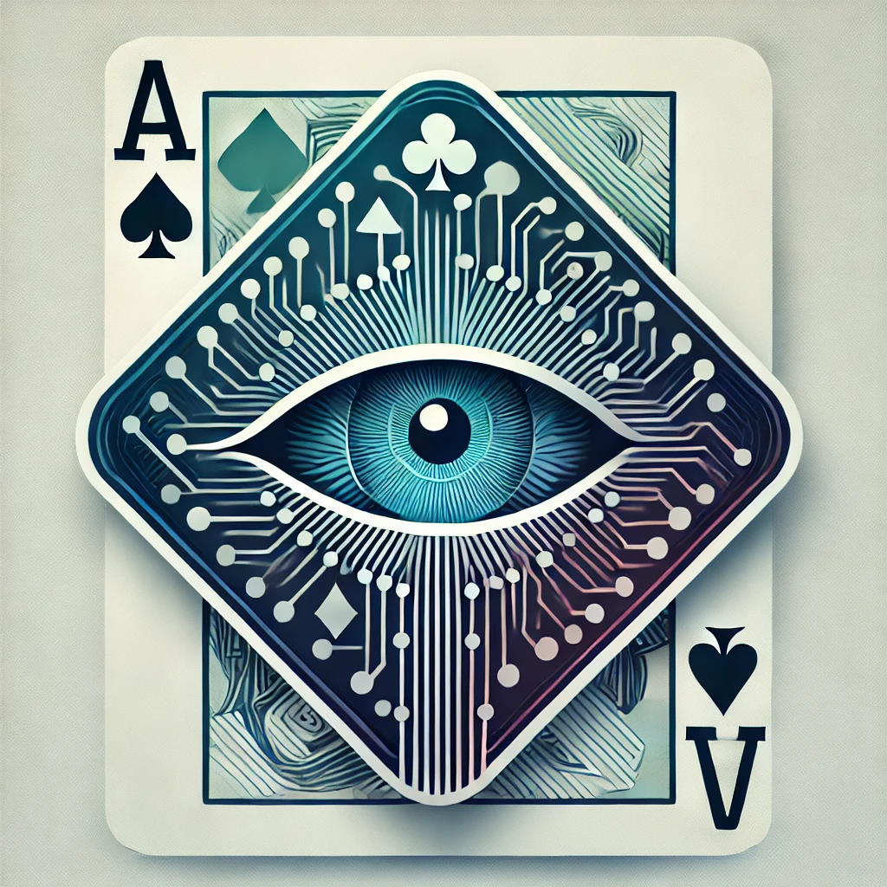
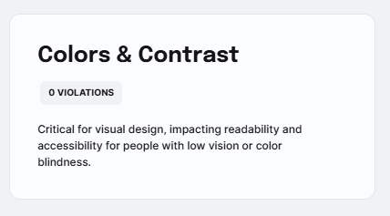
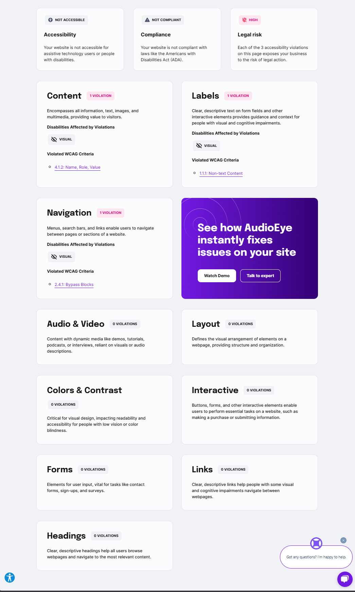

<!--  -->

# Concentration Game

The purpose of the game is to test your memory and ability to concentrate. It does this by selecting three images at random from twelve possibilities. Then you will be shown all available images and you have to select the three you were shown, in the sequence you were shown them.
You must get two out of three correct in order to win the game.

I initially chose this game because it was the only one that was in any way nostalgic, and becuase I immedialtey thought of ways to enhance the game and improve the player's experience.

- [Link to play the game online](https://kjwagner613.github.io/Concentration-Game)
- [Insrtuctions Link](https://sites.google.com/view/concentration-game-instruct/home)
- [Planning Materials Link](https://home.microsoftpersonalcontent.com/:fl:/g/contentstorage/CSP_73eeea4f-913f-4d41-86d3-5fed132ec629/IQKwQipqtd-aTZm2faXSg1QuAZj0wHnE2npXLCfR2LaBPFc?e=h6OQ90&nav=cz0lMkZjb250ZW50c3RvcmFnZSUyRkNTUF83M2VlZWE0Zi05MTNmLTRkNDEtODZkMy01ZmVkMTMyZWM2MjkmZD1iJTIxVC1ydWN6LVJRVTJHMDFfdEV5N0dLUkNyRU9TbDhCQk11cUdscERKODNaVnpGZm9tV2JpdlFhc2dFY2VTdGdyYSZmPTAxNDVIWUpORlFJSVZHVk5PN1RKR1pUTlQ1VVhKSUdWQk8mYz0lMkYmYT1Mb29wQXBwJnA9JTQwZmx1aWR4JTJGbG9vcC1wYWdlLWNvbnRhaW5lciZ4PSU3QiUyMnclMjIlM0ElMjJUMFJUVUh4b2IyMWxMbTFwWTNKdmMyOW1kSEJsY25OdmJtRnNZMjl1ZEdWdWRDNWpiMjE4WWlGVUxYSjFZM290VWxGVk1rY3dNVjkwUlhrM1IwdFNRM0pGVDFOc09FSkNUWFZ4UjJ4d1JFbzRNMXBXZWtabWIyMVhZbWwyVVdGelowVmpaVk4wWjNKaGZEQXhORFZJV1VwT1FsbFhRalZIUzBwUVExRmFRVEpITTB3elNUUTFXVFJHVFVnJTNEJTIyJTJDJTIyaSUyMiUzQSUyMjkzZGY3YzZlLTkwMTctNGE0Ny04NzE3LThjN2JiZTNjZTA2MyUyMiU3RA%3D%3D)

### Attributions:

- AI use - Aria, GPT4, Copilot and Gemini - used to "peer-review" in that I compared AI to AI, to help provide direction to solve issues.

- Was looking for a way to control how long the images were being displayed, I found setTimeout at: [MDN setTimeout:](https://developer.mozilla.org/en-US/docs/Web/API/WorkerGlobalScope/setTimeout).

- I was gettinng an error saying something was not loaded when i knew it was there and no errors, googled that and found: [DOM Content Loaded](https://dev.to/smpnjn/waiting-for-the-dom-to-be-ready-in-javascript-42l7) to wrap around the JavaScript. 
  wich I have now taken out. Seems the error only existed while the code was not long enough to delay the JavaScript load.

 

### Technology Used:

1. HTML
   - Basic building blocks for structure. So far, everything else uses what was coded in HTML for their purposes.
2. Cascading Style Sheets
   - Button placement, color
   - Layout of images for quiz
   - Allows personalization, aesthetics, appeal.
3. JavaScript
   - Provides functionality to all other parts of the site.
4. Flex
   - To center and align most items and text.
5. Grid
   - The structure for the quiz of 12 images.
6. GitHub
   - A platform that can help manage the development, deployment, and lifecycle of a program.
7. AI .. ( Copilot, Aria, ChatGPT, Gemini ) - Each has their strengths and weaknesses. They made the images I used for the 12 animals. - Provided consultation on errors, syntax and best practices.  
    

### Future Enhancements:

1. The game is called Concentration, not Recall. Since the correct selection of images focuses more on memory; recall. Concentration is tested during the varying black frames in the space between. In the future there will be many more images per sequence, and longer black empty spaces. This would increase the challenge to concentrate, for whose mind wanders when something is drawing focus, its when focus is left to our own will that day dreaming is more apt to occur.
2. Add title graphic to image viewer, instead of jumping in to black then the first image.
3. Add more to quiz and option of themes for images.
4. Visual sequences in sound.
5. Distrations
   - Either sound or images, depending on what type of visual sequnce the player selected, that contrast with the visual sequence.
6. The game is called Concentration, not recall. since the correct selection of images focuses more on memory, recall, the concentration part is tested durin the varying black frames in the space between. In the future there will be many more images per sequence, and longer black spaces. Thus, increasing the challenge to concentration, for whose mind wanders when someone is drawing focus, its when focus is left to the observer that day dreaming is more apt to occur

### Governance:

Color Compliance:

Full report:

